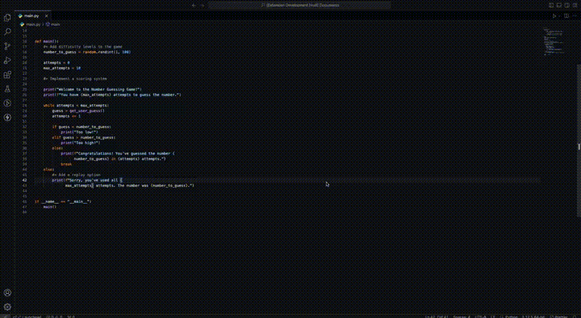

# Plain Tasks
Plain Tasks is a simple extension for keeping track of tasks directly from your code. It captures tasks from your comments and saves them to a `tasks.md` file.

> **No complex setup, no unnecessary features—just straightforward task management**.

## How it works

1. While coding, just add a `+` after your comment symbol to mark a task:

    ```python
    #+ Optimize callback function
    ```

    or

    ```js
    //+ Optimize callback function
    ```

    * Support for:
        - Hyphen comments `--`
        - Double slash comments `//`
        - Numeric sign comments `#`

    

2. Use the shortcut `Ctrl+Shift+P` (Windows/Linux) or `Cmd+Shift+P` (macOS) to open the Command Palette.

    

3. Type `Add Tasks` to gather all your tasks and save them to a `tasks.md` file.

## Why Plain Tasks?

- **Simplicity**: Just add a `+` and you’re done.
- **Ease of Use**: One command to save all tasks.
- **No Overhead**: Focus on your code, not on complex setups.

Enjoy task management made simple!

## Support Me

If you have any questions, suggestions, or just want to say hi, feel free to [contact me](https://www.linkedin.com/in/ismael-porto/). Your feedback helps improve the extension!

If you find this extension useful, consider [supporting me](https://paypal.me/isporto?country.x=MX&locale.x=es_XC) to help with development and future updates.

Thank you for using Plain Tasks!
